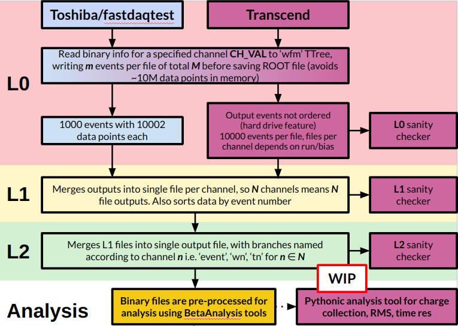

# Binary file scanning scripts

The following workflow describes how to convert .trc files to ROOT files in a compact format. Due to the differences in the .trc file structures, and the sheer size of these files, a three-tier pre-processing conversion is employed to generate files that can be used as input to the Beta Analyser script. An illustration of this is shown here:



## [L0 pre-processing]: converting .trc to .root files

The L0 script reads in the .trc binary files from the respective fastdaqtest/Transcend locations, and converts them to ROOT files in a `wfm` TTree. This reads files per channel to keep processing time and memory usage manageable, so for each channel the `-ch` needs to be specified, i.e.

If processing the binary files from the Transcend hard drive
```
python L0_file_writer_Transcend.py -i /media/gp19133/Transcend/TB_SPS_ETL_sensors_June2024/220V/ -o BTR_Transcend_220_l0/ -ch 1
```
If processing the binary files from the fastdaqtest hard drive
```
python L0_file_writer_fastdaqtest.py -i /media/gp19133/EXTERNAL_USB/fastdaqtest/binary_files/ -o BTR_fastdaqtest_l0/ -ch 1
```

The two different scripts read in N events at a time, and write them to ROOT before moving to the next set of events: this is required to avoid ~10,000,000 events being stored in memory before writing to file (#justpythonthings)

The two different scripts are required as the binary files on the fastdaqtest Toshiba hard drive contain 10,002,000 data points per file, across 1000 events, so need to be processed per binary file.

The Transcend script is not limited in this way, so can read multiple binary files and write them to files in sets of 10000 events. Note that the events in these files are read according to how they are taken from the hard drive, and are not ordered by event number at this stage. L1 and L2 are required for further processing.

The L0 sanity check script is to ensure the files are written and the branches filled correctly (this needs to be configured manually to work, however).

## [L1 pre-processing]: Merging into a single file per channel

The L1 script runs over the output of the L0 Transcend script, and merges each file of 10000 events into a single file per channel. Again, this needs to be run for each channel separately.

```
python L1_combine_and_reorder_by_event.py -i BTR_Transcend_220_l0/ -o BTR_Transcend_220_l1/ -ch 1
```

The output will be N ROOT files, one for each of the N channels. This also sorts the data by event number, given as aforementioned the data taken from the Transcend hard drive appears to be randomised when written to ROOT files (and is a result of reading from the hard drive itself, not these scripts)

## [L2 pre-processing]: Merging files per channel into a single file with data per channel

The L2 script is run on the output of the L1 script, and merges the N files into a single file. The files are merged on the 'event' column, and the 'w' and 't' branches from the respective channels are matched by event into 'wn' and 'tn' branches, where n is the channel number. This is the final preprocessing step before analysis in Fede's scripts.

```
python L1_combine_channels.py -i BTR_Transcend_220_l1/ -o BTR_Transcend_220_l2
```
